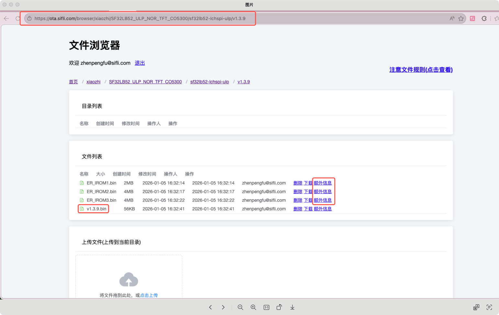
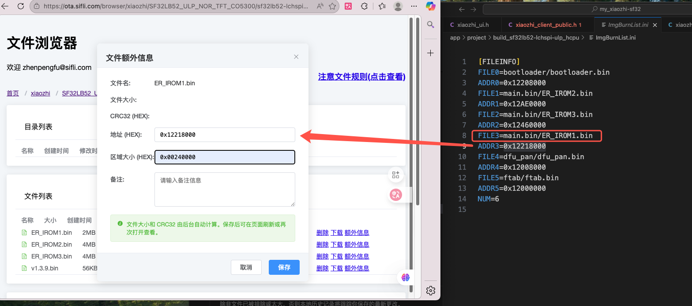
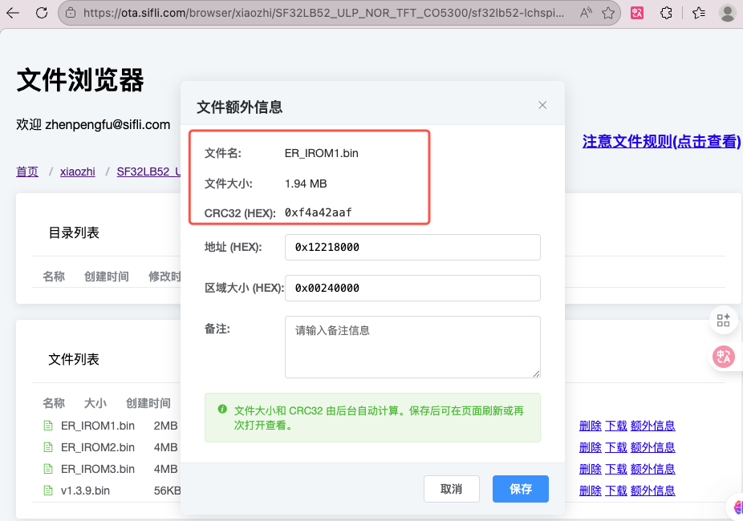
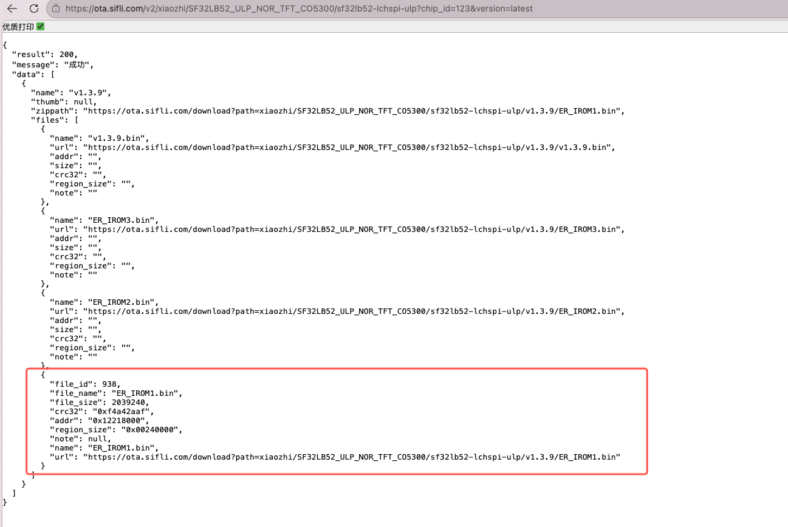

## DFU_PAN 简介

DFU_PAN是一个基于蓝牙PAN网络的OTA固件升级中间件，它允许设备通过蓝牙网络连接到OTA服务器，下载并更新固件。整个流程包括设备注册、版本检查、固件下载和更新等步骤。

想使用DFU_PAN功能需添加examplele/dfu_pan子工程，搭配middleware/dfu_pan中间件实现

1.主程序project/proj.conf文件中添加，使能DFU_PAN功能
```
CONFIG_USING_DFU_PAN=y
```

2.需要在主工程project/SConstruct文件下添加子工程语法： 
```
AddDFU_PAN(SIFLI_SDK)
```
位置通常是DoBuilding(TARGET, objs)下方

详情请参考：[DFU_PAN](https://docs.sifli.com/projects/sdk/latest/sf32lb52x/middleware/dfu_service/dfu_pan_firmware_generation.html)

## 小智固件包部署

在 xiaozhi-sf32 项目中，有三个镜像文件，分别存放代码，图片，字体资源，我们可以根据需要升级的固件进行部署在服务器上

### 1.目录结构
下方是小智的OTA不同开发板署目录地址，里面存放了小智支持的不同板子的名称：
https://ota.sifli.com/browser/xiaozhi

可进行自定义访问目录，创建目录只需在地址栏填入相创建的目录结构即可，最后一级目录名需要是version号，如果用新目录还需修改`xiaozhi_client_public.c`中相关函数


### 2.部署规则
1. 上传一个与version目录同名的bin文件，如v1.3.9，此bin文件起占位符作用响应当前版本，小智有版本号迭代，因此部署占位符bin文件需要比小智当前版本更高（小智当前版本可查看xiaozhi_client_public.h中VERSION定义）

2. 小智项目有多个bin文件分别存放代码，图片，字体资源，可根据实际需要升级的固件及固件数量上传，最大限度上传3个实际功能固件

3.填写固件信息，上传文件后需要点击每个文件右侧的额外信息进行填写，填写完成后点击保存，可根据自身程序所使用的ptab.json查询固件起始地址和固件大小信息




4.点击保存后，再次点击额外信息进行查看是否生成了crc32值





也可以根据响应地址查看，是否能成功响应数据：
https://ota.sifli.com/v2/xiaozhi/SF32LB52_ULP_NOR_TFT_CO5300/sf32lb52-lchspi-ulp?chip_id=123&version=latest

此处演示只填写了ER_IROM1.bin的对应信息，需要保证所有上传的固件都填写了对应信息

**注意**
地址中chip_id应该填写设备ID，此处只为验证是否成功响应，可以填一串任意数字，version填写latest是获取最新固件信息